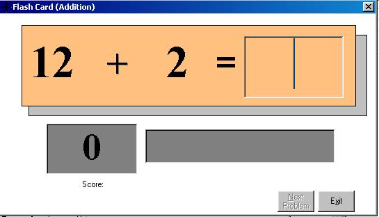



## \[\[\[A Good Flashcard Game\!\!

### Description

This is a very fun and adictive program. It can actually aide the user in developing their math skills. it's a sort of flashcard game. based on the chosen operation the computer will choose two random numbers and the user will have to answer the math problem within 5 secs., includes addition, subtracion, multiplication and division. feel free to try it! thanks.. PLEASE VOTE FOR THIS CODE
 
### More Info
 

             |
---                |---
**Submitted On**   |2003-09-03 10:07:02
**By**             |[Carlo Rodriguez](https://github.com/Planet-Source-Code/PSCIndex/blob/master/ByAuthor/carlo-rodriguez.md)
**Level**          |Beginner
**User Rating**    |4.6 (23 globes from 5 users)
**Compatibility**  |VB 5\.0, VB 6\.0
**Category**       |[Complete Applications](https://github.com/Planet-Source-Code/PSCIndex/blob/master/ByCategory/complete-applications__1-27.md)
**World**          |[Visual Basic](https://github.com/Planet-Source-Code/PSCIndex/blob/master/ByWorld/visual-basic.md)
**Archive File**   |[\[\[\[A\_Good\_164001932003\.zip](https://github.com/Planet-Source-Code/carlo-rodriguez-a-good-flashcard-game__1-48192/archive/master.zip)

